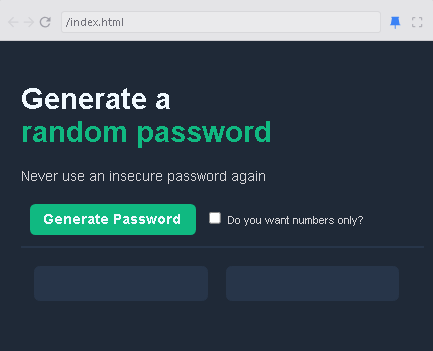
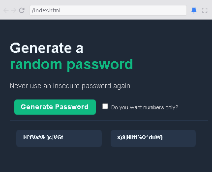
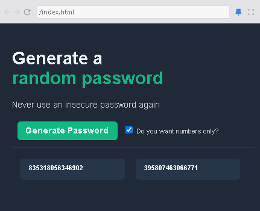

# Random Password Generator

<h1>Overview</h1>

This project is a simple random password generator that helps users create secure passwords with a single click. Users have the option to generate passwords that include letters, numbers, and special characters, or restrict the output to numbers only.

# Features

Generate a random password with letters, numbers, and symbols.

Option to generate numeric-only passwords.

Quick and simple UI with a single click generation.

# Technologies Used

HTML for structure

CSS for styling

JavaScript for logic

# Usage

Open the index.html file in a browser.

Click the "Generate Password" button to generate random passwords.

Check the "Do you want numbers only?" checkbox if you want passwords containing only numbers.

Two different password options will be displayed for you to choose from.

# Files Structure

index.html - The main HTML structure.

index.css - Styling for the UI.

index.js - JavaScript file containing password generation logic.

# How It Works

A random password is generated using predefined characters.

If the "Numbers Only" checkbox is checked, the generator will create a password containing only digits.

Clicking the "Generate Password" button will create two new random passwords.

# Preview
  

# Future Improvements

Copy to clipboard functionality.

Allow users to customize password length.

Dark mode theme.

# License

This project is open-source and free to use under the MIT License.

Made with ❤️ by Hannes Jansen van Rensburg
